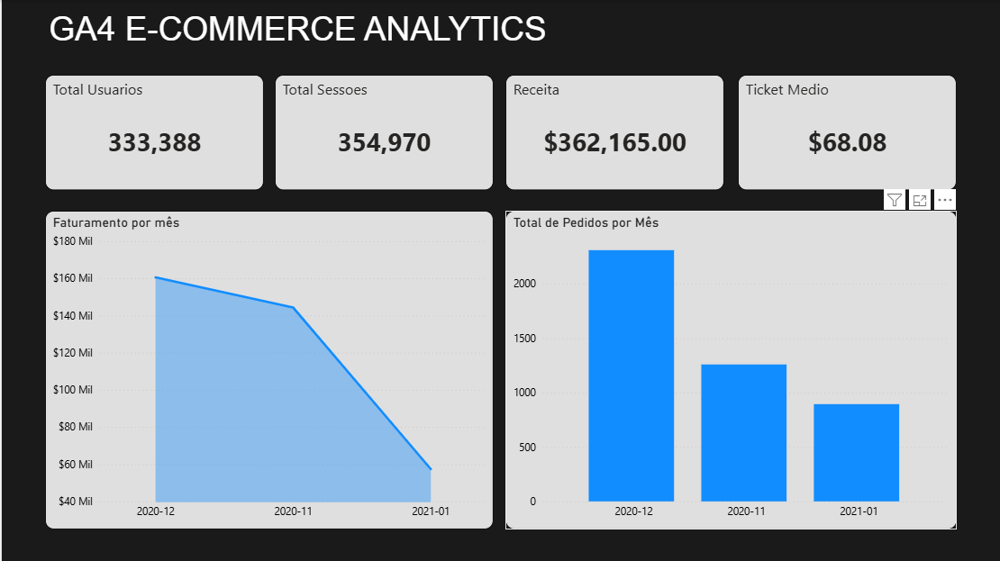
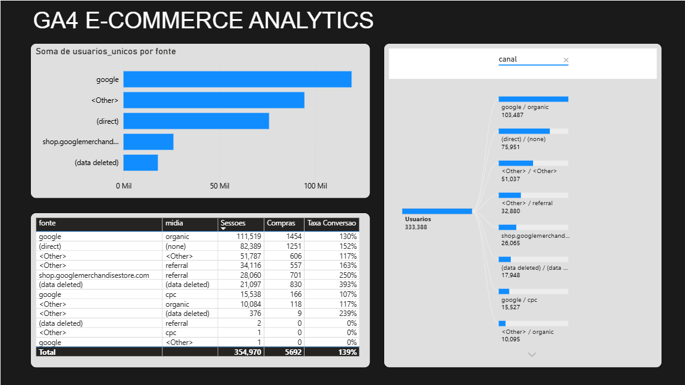
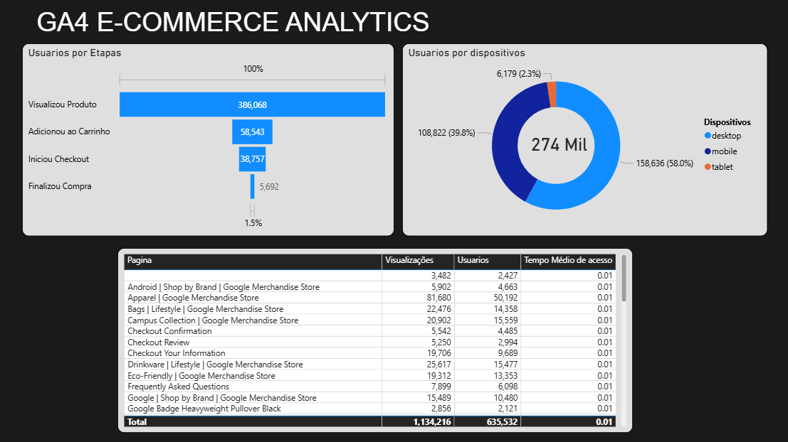

# GA4 Analytics Pipeline — BigQuery + Power BI

Pipeline analítico end-to-end sobre um dataset público de e-commerce com arquitetura em camadas (Raw > Gold). O projeto engloba o desenvolvimento de views SQL no Google BigQuery para tratamento e padronização dos dados (ETL), culminando em um dashboard interativo no Power BI focado em KPIs de aquisição, comportamento e receita.

## 📊 Dashboard Interativo

### 1. Visão Executiva

### 2. Aquisição de Tráfego

### 3. Comportamento e Funil

## 🏗 Arquitetura do Projeto (3 Camadas)

O projeto segue uma arquitetura em camadas, garantindo **rastreabilidade e padronização dos dados**, requisitos essenciais em times de Governança de Dados (como na RD Saúde).

1. **GA4 (Fonte):** Coleta de eventos de navegação e e-commerce padrão.
2. **Raw Layer (BigQuery):** Dados brutos armazenados nas tabelas particionadas `events_*`. Consultas exploratórias disponíveis em `raw_queries/`.
3. **Gold Layer (BigQuery):** Camada de transformação (ETL). Views criadas com regras de negócios padronizadas prontas para consumo. Scripts em `gold_layer/`.
4. **Visualização (Power BI):** Dashboard construído a partir das views da Gold Layer, reduzindo custos de processamento e garantindo integridade e confiabilidade dos KPIs.

## 🥇 Gold Layer — Views de Transformação

As views criadas encapsulam a lógica de negócio e reduzem a complexidade para o analista no Power BI:

- **`vw_trafego_por_canal.sql`**: Aquisição por fonte e mídia, com taxa de conversão calculada.
- **`vw_funil_conversao.sql`**: Etapas do funil com taxas de abandono calculadas (view > cart > checkout > purchase).
- **`vw_receita_mensal.sql`**: Receita agregada por mês com variação MoM (Month-over-Month) estruturada em SQL.
- **`vw_comportamento_dispositivo.sql`**: Engajamento, receita e conversão analisados por tipo de dispositivo e OS.
- **`vw_top_paginas.sql`**: Otimização da busca por páginas com maiores volumes de visualizações e tempo médio de engajamento do usuário.

## 💡 Insights Extraídos

1. **Abandono de Carrinho:** Foi identificado no funil de conversão que a maior queda de retenção ocorre entre a visualização de um item e a adição dele ao carrinho, indicando possível fricção de interface ou precificação na página.
2. **Receita Mobile vs Desktop:** Apesar de o tráfego Web/Mobile possuir um volume alto de sessões, o ticket médio e a taxa de conversão advindos de conexões em Desktop mostram-se expressivamente maiores.
3. **Canais de Aquisição:** O tráfego Direct/Organic é a maior fonte de usuários, contudo, é possível analisar nas tabelas da Gold Layer a representatividade monetária isolada de cada source/medium.

## 🚀 Como Reproduzir o Projeto

1. **Google Cloud Platform:** 
   - Crie um projeto próprio no GCP e ative o BigQuery.
   - Adicione o dataset público `bigquery-public-data.ga4_obfuscated_sample_ecommerce`.
2. **Modelagem de Dados (BigQuery):**
   - Execute as queries exploratórias da pasta `raw_queries/` para entender as colunas (event_params, event_name, user_pseudo_id).
   - Crie um dataset vazio `ga4_gold` no seu projeto GCP.
   - Execute de forma literal os scripts de `gold_layer/` no BigQuery para materializar as Views sobre os dados brutos.
3. **Visualização (Power BI):**
   - Conecte o Power BI Desktop via conector *Google BigQuery*, informando o seu `Project ID`.
   - Importe as views do dataset `ga4_gold`.
   - (Alternativa) Os arquivos `.csv` resultantes destas queries foram consolidados no diretório `data/` para uso de modo *Fallback*.
